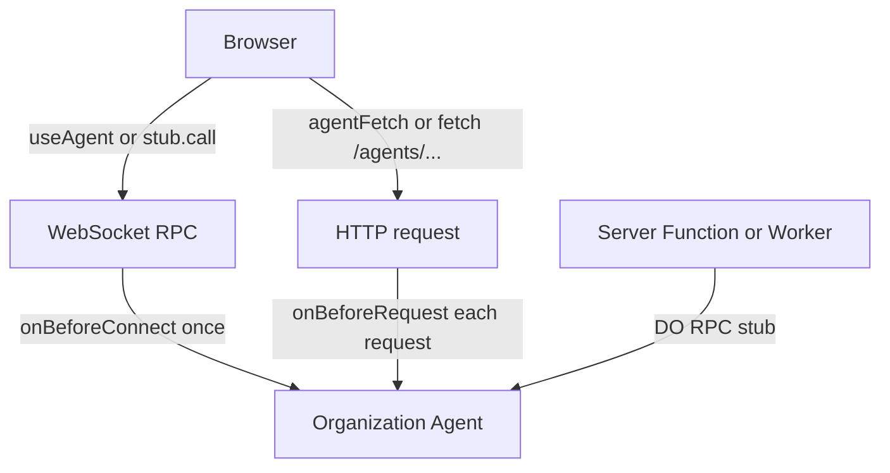
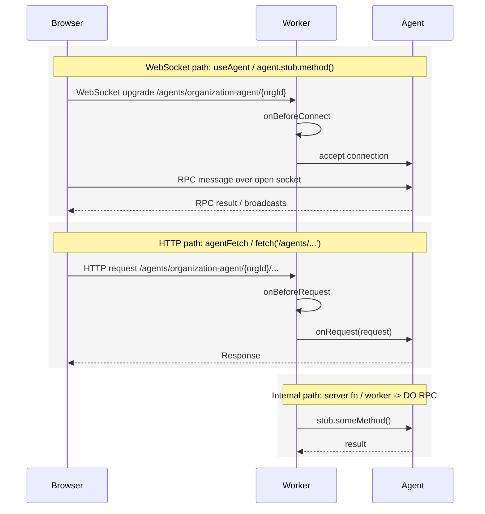
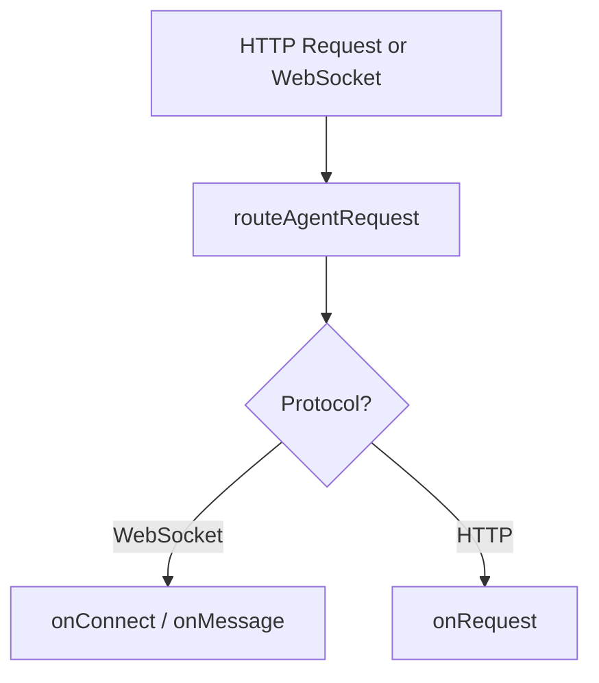

# Organization Agent Access Pattern Research

## Question

Can this app call the organization agent directly from the client via `useAgent().stub`, instead of going through TanStack Start `createServerFn` handlers like `deleteInvoice`?

Short answer: yes, technically. Not as a blanket replacement. The safer general pattern here is hybrid:

- use one client agent connection per org route for realtime pushes, activity, progress, presence, and selected low-risk RPC
- keep server functions as the main authority boundary for session-sensitive reads/writes and anything involving secrets, signed URLs, or strict per-request authorization

## Executive Take

There are three distinct ways to talk to an agent in this stack:

1. `useAgent()` / `agent.stub.method()` -> WebSocket -> `@callable()` methods
2. `agentFetch(...)` or `fetch('/agents/...')` -> HTTP -> `onRequest()`
3. Worker/server function -> Durable Object RPC stub -> direct method call

These are different transports with different auth properties.

- WebSocket RPC is authorized at connect time via `onBeforeConnect`
- HTTP agent requests are authorized per request via `onBeforeRequest`
- Worker -> agent DO RPC is internal server-side code; the Worker decides auth before making the call

That transport split is the key reason not to replace server functions with client `useAgent()` RPC by default.

## Transport Model

### Agent access paths



### Runtime flow



## Current Codebase Shape

The app already has the pieces for both paths.

`src/routes/app.$organizationId.tsx` opens one org-scoped agent connection and puts the stub in context:

```tsx
const agent = useAgent<OrganizationAgent, OrganizationAgentState>({
  agent: "organization-agent",
  name: organizationId,
  onMessage: (event) => { /* activity + invalidation */ },
  onStateUpdate: (state) => { /* cache state */ },
});

<OrganizationAgentProvider
  value={{
    call: agent.call,
    stub: agent.stub,
    setState: agent.setState,
    ready: agent.ready,
    identified: agent.identified,
  }}
/>
```

`src/routes/app.$organizationId.invoices.tsx` still routes invoice operations through server functions:

```tsx
const deleteInvoice = createServerFn({ method: "POST" })
  .inputValidator(Schema.toStandardSchemaV1(deleteInvoiceSchema))
  .handler(({ context: { runEffect }, data }) =>
    runEffect(
      Effect.gen(function* () {
        const request = yield* AppRequest;
        const auth = yield* Auth;
        const validSession = yield* auth.getSession(request.headers).pipe(
          Effect.flatMap(Effect.fromOption),
        );
        const organizationId = yield* Effect.fromNullishOr(
          validSession.session.activeOrganizationId,
        );
        const { ORGANIZATION_AGENT } = yield* CloudflareEnv;
        const id = ORGANIZATION_AGENT.idFromName(organizationId);
        const stub = ORGANIZATION_AGENT.get(id);
        yield* Effect.tryPromise(() => stub.softDeleteInvoice(data.invoiceId));
      }),
    ),
  );
```

`src/worker.ts` already protects agent connect/request routing:

```ts
const routed = await routeAgentRequest(request, env, {
  onBeforeConnect: async (req) => {
    const session = await runEffect(/* auth.getSession(req.headers) */);
    if (Option.isNone(session)) {
      return new Response("Unauthorized", { status: 401 });
    }
    const agentName = extractAgentInstanceName(req);
    const activeOrganizationId = session.value.session.activeOrganizationId;
    if (!activeOrganizationId || agentName !== activeOrganizationId) {
      return new Response("Forbidden", { status: 403 });
    }
  },
  onBeforeRequest: async (req) => {
    // same active-organization check
  },
});
```

So the current app already does:

- WebSocket auth at the worker edge
- direct DO RPC inside the worker
- client agent connection in the org layout
- server functions as the main route/data/mutation API

## What The Docs Say

### `useAgent` is WebSocket; HTTP is a separate client path

The client SDK docs are explicit:

> "The client SDK offers two ways to connect with a WebSocket connection, and one way to make HTTP requests."

> | `useAgent` | React hook with automatic reconnection and state management |
> | `AgentClient` | Vanilla JavaScript/TypeScript class for any environment |
> | `agentFetch` | HTTP requests when WebSocket is not needed |

Source: `refs/cloudflare-docs/src/content/docs/agents/api-reference/client-sdk.mdx:10`, `refs/cloudflare-docs/src/content/docs/agents/api-reference/client-sdk.mdx:18`

And later:

> "For one-off requests without maintaining a WebSocket connection"

> "Use `agentFetch`"

Source: `refs/cloudflare-docs/src/content/docs/agents/api-reference/client-sdk.mdx:339`, `refs/cloudflare-docs/src/content/docs/agents/api-reference/client-sdk.mdx:376`

So:

- `useAgent()` does not make HTTP requests to your agent's `onRequest()` handler
- `useAgent()` is for the WebSocket transport: state sync, broadcasts, `@callable()` RPC
- HTTP to agents is a different path, via `agentFetch(...)` or normal `fetch(...)` to an agent route handled by `onRequest()`

### Agents also support plain HTTP via `onRequest()`

The HTTP docs say:

> "Agents can handle HTTP requests and stream responses using Server-Sent Events (SSE). This page covers the `onRequest` method and SSE patterns."

> "Define the `onRequest` method to handle HTTP requests to your agent"

Source: `refs/cloudflare-docs/src/content/docs/agents/api-reference/http-sse.mdx:10`, `refs/cloudflare-docs/src/content/docs/agents/api-reference/http-sse.mdx:14`

The SDK docs say the same thing more directly:

> "Handle HTTP requests with `onRequest()`. This is called for any non-WebSocket request to your agent."

Source: `refs/agents/docs/http-websockets.md:69`

So yes: agents are not only WebSocket endpoints. They can also expose plain HTTP endpoints.

### How a client actually makes HTTP requests to an agent

There are two practical client-side ways.

First, the default agent route shape is:

> `https://your-worker.dev/agents/{agent-name}/{instance-name}`

Source: `refs/cloudflare-docs/src/content/docs/agents/api-reference/routing.mdx:17`

And the getting-started docs say:

> "By default, agents are routed at `/agents/{agent-name}/{instance-name}`."

Source: `refs/cloudflare-docs/src/content/docs/agents/getting-started/add-to-existing-project.mdx:368`

In this repo, the agent name passed to `useAgent` is `"organization-agent"` in `src/routes/app.$organizationId.tsx:118`, and the instance name is the `organizationId` in `src/routes/app.$organizationId.tsx:119`.

So the actual base URL for this app's organization agent is:

```txt
/agents/organization-agent/{organizationId}
```

Examples:

```txt
/agents/organization-agent/org_123
/agents/organization-agent/acme
```

That is why a normal browser `fetch(...)` can work: the agent is reachable at a real HTTP URL.

#### 1. `agentFetch(...)`

This is the SDK's HTTP client for agents:

```ts
import { agentFetch } from "agents/client";

const response = await agentFetch(
  {
    agent: "organization-agent",
    name: organizationId,
  },
  {
    method: "POST",
    headers: { "Content-Type": "application/json" },
    body: JSON.stringify({ invoiceId }),
  },
);

const data = await response.json();
```

For this repo, that resolves to an HTTP request against roughly:

```txt
/agents/organization-agent/{organizationId}
```

If you pass `path: "delete-invoice"`, it becomes roughly:

```txt
/agents/organization-agent/{organizationId}/delete-invoice
```

The SDK implementation shows this directly:

```ts
return PartySocket.fetch({
  party: agentNamespace,
  prefix: "agents",
  room: opts.name || "default",
  ...opts,
}, init)
```

Source: `refs/agents/packages/agents/src/client.ts:412`

There are test examples for `path` too:

```ts
const response = await agentFetch({
  agent: "TestStateAgent",
  name: instanceName,
  path: "state",
})
```

Source: `refs/agents/packages/agents/src/react-tests/client.test.ts:384`

So a more concrete example for invoice delete would be:

```ts
import { agentFetch } from "agents/client";

const response = await agentFetch(
  {
    agent: "organization-agent",
    name: organizationId,
    path: "delete-invoice",
  },
  {
    method: "POST",
    headers: { "Content-Type": "application/json" },
    body: JSON.stringify({ invoiceId }),
  },
);

if (!response.ok) throw new Error("Delete failed");
```

Which would hit:

```txt
POST /agents/organization-agent/{organizationId}/delete-invoice
```

Docs source:

> "For one-off requests without maintaining a WebSocket connection"

> `import { agentFetch } from "agents/client";`

Source: `refs/cloudflare-docs/src/content/docs/agents/api-reference/client-sdk.mdx:339`

#### 2. Plain `fetch(...)` to the agent route

Agents are routed under paths like `/agents/{agent}/{instance}/...`, and sub-paths are forwarded to `onRequest()`:

> `/agents/api/v1/users     -> agent: "api", instance: "v1", path: "/users"`

Source: `refs/cloudflare-docs/src/content/docs/agents/api-reference/routing.mdx:533`

Because the agent has a real HTTP URL, the browser can also do normal fetches:

```ts
const response = await fetch(
  `/agents/organization-agent/${organizationId}/delete-invoice`,
  {
    method: "POST",
    headers: { "Content-Type": "application/json" },
    body: JSON.stringify({ invoiceId }),
  },
);
```

This would hit `OrganizationAgent.onRequest(request)` after `onBeforeRequest` passes.

If you only wanted the base agent request with no extra sub-path, it would simply be:

```ts
const response = await fetch(`/agents/organization-agent/${organizationId}`);
```

That would hit `onRequest()` with the base instance URL.

#### Which one is better?

- `agentFetch(...)`: clearer intent; SDK-native; good when you want the client helper
- `fetch(...)`: simplest when the route is same-origin and you just want plain HTTP

Either way, this is still the HTTP path, not the WebSocket RPC path.

### Direct examples, side by side

Assume:

```ts
const organizationId = "acme";
const invoiceId = "inv_123";
```

#### WebSocket RPC with `useAgent`

```ts
const agent = useAgent({
  agent: "organization-agent",
  name: organizationId,
});

await agent.stub.softDeleteInvoice(invoiceId);
```

Transport:

```txt
WebSocket to /agents/organization-agent/acme
then RPC message over that socket
```

#### HTTP with `agentFetch`

```ts
await agentFetch(
  {
    agent: "organization-agent",
    name: organizationId,
    path: "delete-invoice",
  },
  {
    method: "POST",
    headers: { "Content-Type": "application/json" },
    body: JSON.stringify({ invoiceId }),
  },
);
```

Transport:

```txt
POST /agents/organization-agent/acme/delete-invoice
```

#### HTTP with plain `fetch`

```ts
await fetch(`/agents/organization-agent/${organizationId}/delete-invoice`, {
  method: "POST",
  headers: { "Content-Type": "application/json" },
  body: JSON.stringify({ invoiceId }),
});
```

Transport:

```txt
POST /agents/organization-agent/acme/delete-invoice
```

So `agentFetch(...)` and direct `fetch(...)` are not magic. In the default routing setup, they are just different ways to target the agent's HTTP URL.

### Host, path, query, and custom routing

The client SDK supports transport config like `host`, `path`, and `query` for WebSocket clients:

```ts
useAgent({
  agent: "ChatAgent",
  name: "room-123",
  host: "my-worker.workers.dev",
  path: "/custom/path",
  query: { token: "abc123" },
});
```

Source: `refs/cloudflare-docs/src/content/docs/agents/api-reference/client-sdk.mdx:116`

For custom URL routing, the docs also support `basePath` on the client and server-side forwarding with `getAgentByName(...).fetch(request)`:

```ts
const agent = useAgent({
  agent: "UserAgent",
  basePath: "user",
});
```

```ts
if (url.pathname.startsWith("/user/")) {
  const session = await getSession(request);
  const agent = await getAgentByName(env.UserAgent, session.userId);
  return agent.fetch(request);
}
```

Source: `refs/cloudflare-docs/src/content/docs/agents/api-reference/routing.mdx:166`

That matters because agent HTTP does not have to use the default `/agents/{agent}/{instance}` shape if the server wants to hide instance selection behind app routing.

### `routeAgentRequest` hooks are transport-specific auth hook points

The routing docs say:

> "onBeforeConnect: Called before WebSocket connections"

> "onBeforeRequest: Called before HTTP requests"

> "These hooks are useful for authentication and validation."

Source: `refs/agents/docs/routing.md:284`, `refs/agents/docs/routing.md:288`, `refs/agents/docs/routing.md:295`

Cloudflare's routing docs show the same split:



Source: `refs/cloudflare-docs/src/content/docs/agents/api-reference/routing.mdx:629`

Concretely:

- `onBeforeConnect` runs before the WebSocket handshake is accepted
- `onBeforeRequest` runs before plain HTTP requests routed to the agent
- `useAgent()` only hits the first path
- `agentFetch()` or `fetch('/agents/...')` hits the second path

In this repo, that means:

- `useAgent().stub.softDeleteInvoice(...)` would go through WebSocket RPC, so `onBeforeConnect` matters
- it would not invoke `onBeforeRequest`
- `onBeforeRequest` would matter only if you exposed an HTTP endpoint on the agent via `onRequest()` and called it over HTTP

### `@callable()` is for external clients; worker code should use DO RPC directly

Agents callable docs:

> "The `@callable()` decorator is specifically for WebSocket-based RPC from external clients. When calling from within the same Worker or another agent, use standard Durable Object RPC directly."

Source: `refs/cloudflare-docs/src/content/docs/agents/api-reference/callable-methods.mdx:59`

And the Agents repo docs are even more direct:

> "DO RPC is more efficient for internal calls since it does not go through WebSocket serialization."

Source: `refs/agents/docs/callable-methods.md:509`

### Durable Objects are a good domain/coordination boundary

Durable Objects docs:

> "Each Durable Object is a single-threaded, globally-unique instance with its own persistent storage."

> "Workers are stateless functions ... A common pattern is to use Workers as the stateless entry point that routes requests to Durable Objects when coordination is needed. The Worker handles authentication, validation, and response formatting, while the Durable Object handles the stateful logic."

Source: `refs/cloudflare-docs/src/content/docs/durable-objects/best-practices/rules-of-durable-objects.mdx:10`, `refs/cloudflare-docs/src/content/docs/durable-objects/best-practices/rules-of-durable-objects.mdx:97`

This lines up well with this repo's current split: worker/server fn for auth and request context, organization agent for org-scoped stateful logic.

### WebSocket callables do not have request context

`getCurrentAgent()` docs show context availability:

| Invocation | `connection` | `request` |
| --- | --- | --- |
| `Custom method (via RPC)` | Yes | No |

Source: `refs/cloudflare-docs/src/content/docs/agents/api-reference/get-current-agent.mdx:232`

This is the key constraint. A WebSocket RPC method can see the current connection, but not the original request headers/cookies.

So there are two distinct client-side auth models:

- **HTTP agent request auth**: every HTTP request can be checked by `onBeforeRequest`
- **WebSocket callable auth**: the connection is checked at connect time by `onBeforeConnect`, then later RPC calls run over that accepted socket

### Readonly is not a full authorization system

Readonly docs:

> "Only `this.setState()` is gated. A callable can still write to SQL, send emails, call external APIs, or do anything else."

> "The readonly check happens inside `this.setState()`, not at the start of the callable. If your method has side effects before the state write, those will still execute."

Source: `refs/agents/design/readonly-connections.md:174`, `refs/cloudflare-docs/src/content/docs/agents/api-reference/readonly-connections.mdx:500`

That matters a lot here because `OrganizationAgent` writes to SQLite via `OrganizationRepository`; it does not use `this.setState()` for invoice mutations.

### Same-origin cookie auth works for connect, but that is still connect-time auth

Cross-domain auth docs:

> "If the client and server share the origin, the browser will send cookies during the WebSocket handshake. Session based auth can work here."

Source: `refs/agents/docs/cross-domain-authentication.md:23`

That matches this repo: same-origin app, cookie-backed Better Auth session, worker checks it during WebSocket connect.

## HTTP To An Agent: What It Is Good For

Agent HTTP is real and useful. It supports:

- REST-style per-agent endpoints
- uploads
- SSE streaming
- per-request authorization in `onBeforeRequest`
- sub-path routing after `/agents/{agent}/{instance}/...`

The routing docs show sub-path support:

> `/agents/api/v1/users     -> agent: "api", instance: "v1", path: "/users"`

Source: `refs/cloudflare-docs/src/content/docs/agents/api-reference/routing.mdx:533`

So an agent can behave like a small per-instance HTTP API, not just a WebSocket actor.

### What this could look like in this repo

If we wanted invoice deletion over agent HTTP instead of a server function, the shape would be roughly:

```ts
export class OrganizationAgent extends Agent<Env> {
  async onRequest(request: Request): Promise<Response> {
    const url = new URL(request.url);

    if (request.method === "POST" && url.pathname.endsWith("/delete-invoice")) {
      const { invoiceId } = await request.json<{ invoiceId: string }>();
      await this.softDeleteInvoice(invoiceId);
      return Response.json({ success: true, invoiceId });
    }

    return new Response("Not found", { status: 404 });
  }
}
```

And the client could call either:

```ts
await agentFetch(
  { agent: "OrganizationAgent", name: organizationId },
  {
    method: "POST",
    headers: { "Content-Type": "application/json" },
    body: JSON.stringify({ invoiceId }),
  },
);
```

or:

```ts
await fetch(`/agents/organization-agent/${organizationId}/delete-invoice`, {
  method: "POST",
  headers: { "Content-Type": "application/json" },
  body: JSON.stringify({ invoiceId }),
});
```

That would move delete from:

- browser -> server function -> DO RPC

to:

- browser -> HTTP agent route -> `onRequest()`

Security-wise, that would improve over WebSocket RPC for stale-auth concerns because `onBeforeRequest` can run per request. But it still would not obviously beat the existing server-function approach in this repo.

That said, agent HTTP is probably not the main next step for this repo because:

- TanStack Start server functions already provide the app's request boundary
- server functions integrate better with loaders, mutations, and request context
- moving app operations to agent HTTP would introduce a second public request API shape

## The Real Security Difference

This is the core tradeoff.

### Server function path

Each mutation gets a fresh request boundary:

- cookies/headers are present
- `Auth.getSession(request.headers)` runs per call
- active org is checked per call
- env/secrets are available
- TanStack Start loader/query patterns remain simple

### Client WebSocket RPC path

Authorization shifts from request-time to connect-time:

- the worker checks session when the socket connects via `onBeforeConnect`
- later RPC calls run over the already-authorized connection
- the callable method has `connection`, but not `request`
- if the session is revoked, expires, or active org changes elsewhere, the existing socket may remain usable until disconnect/reconnect

This is why `onBeforeRequest` does not solve the stale-auth problem for `useAgent()` RPC. It protects agent HTTP requests, not messages sent over an already-open WebSocket.

### Client HTTP agent path

Each request gets a fresh request boundary:

- `onBeforeRequest` can run each time
- the agent receives a full `Request`
- normal HTTP auth patterns fit naturally
- stale auth is less of a problem than with long-lived WebSockets

But HTTP agent routes still would not replace all current server functions cleanly in this repo, because:

- TanStack Start server functions already provide the app's server boundary
- server functions integrate directly with loaders, mutations, and request context
- some operations need app-specific services and secret handling outside the agent route surface

So your concern is right, just more precisely stated this way:

- it is not true that there are "no checks"
- there are checks at WebSocket connect in `src/worker.ts`
- there is not a built-in per-RPC session re-check like the current server-function path gives you

## Why This Matters In This Repo

Some current operations naturally belong behind server functions.

### `getInvoices`

`src/routes/app.$organizationId.invoices.tsx` does more than fetch rows:

- checks active org from the request session
- in non-local env, signs R2 URLs using `R2_S3_ACCESS_KEY_ID`, `R2_S3_SECRET_ACCESS_KEY`, `CF_ACCOUNT_ID`

That is not a good direct-client-RPC candidate.

### `getInvoiceItems`

Less secret-heavy, but still currently depends on per-request org auth and fits the route loader/query model.

### `createInvoice` / `softDeleteInvoice`

These are technically possible over client RPC, but today they are not safe to move as-is because:

- `OrganizationAgent.createInvoice()` and `OrganizationAgent.softDeleteInvoice()` do not perform authorization checks
- readonly would not protect them because they mutate SQLite, not agent state
- current worker auth is connect-time, not per-call

## Pattern Options

## 1. Server functions for everything

Pros:

- strongest and simplest security story
- per-call authorization remains obvious
- clean TanStack Start loaders/mutations
- easy access to env, request, cookies, secrets

Cons:

- does not use the existing WebSocket RPC path much
- extra worker hop for actions that could be low-latency client -> agent
- duplicates some thin pass-through handlers

## 2. Client RPC for everything

Pros:

- fewer server-function wrappers
- lower latency for some interactions
- one transport for reads/writes/realtime

Cons:

- weaker default auth posture in this app
- easy to accidentally expose SQL-writing methods without real method-level authorization
- harder to use TanStack loader/query patterns for canonical data
- secret-dependent operations still need a server path anyway

I would not recommend this for this codebase.

## 3. Agent HTTP for everything

Pros:

- per-request auth is possible with `onBeforeRequest`
- agents can own REST endpoints, uploads, SSE, and instance-local HTTP APIs

Cons:

- overlaps awkwardly with TanStack Start server functions
- introduces a second public request API surface for app features
- loses some ergonomics of the existing Start loader/mutation patterns

I would not recommend this as the default app pattern either.

## 4. Hybrid split

Recommended.

- **Realtime plane:** WebSocket agent connection from the org layout
- **Request plane:** server functions + loader/query for canonical reads/writes
- **Domain plane:** worker/server functions call the organization agent via DO RPC
- **Optional agent HTTP plane:** only when an agent-owned HTTP API is actually the right shape

This matches both the platform model and the current code.

## Recommended General Pattern

Use this as the default rule in the repo.

### 1. Keep one `useAgent()` in the org layout

Current direction is right:

- one connection per active org route
- put `stub`/`call` in context
- handle broadcasts/activity/invalidation centrally

This is a good fit for realtime behavior.

### 2. Keep TanStack Start server functions as the authority boundary

Use server functions for:

- mutations that require a valid current session on every call
- anything tied to active org membership/role checks
- anything that uses secrets, env, signed URLs, queues, or external credentials
- canonical data fetching used by loaders / `ensureQueryData` / React Query

This matches project guidance too:

> "Start loaders are isomorphic so generally create a server fn with server logic and call it from loader."

Source: `AGENTS.md:95`

### 3. Use direct client RPC only for explicitly connect-time-authorized operations

Good candidates:

- activity/presence/ephemeral commands
- local diagnostics like `getTestMessage()`
- realtime UX actions where connect-time auth is acceptable
- operations that do not require secrets and can tolerate reconnect-based auth refresh

Not good candidates by default:

- destructive mutations
- tenant-sensitive reads/writes without method-level authorization
- anything that writes SQL unless the method checks additional method-level permissions first

### 4. Consider agent HTTP only when you actually want an agent-owned HTTP API

Good candidates for `onRequest()` / `agentFetch()`:

- SSE streaming owned by the agent
- per-instance REST endpoints where the agent itself is the natural HTTP resource
- webhooks or uploads that belong directly to one agent instance

Not the default choice here because:

- the app already has a coherent TanStack Start server-function layer
- app routes already depend on that layer for auth and data loading
- moving app operations to agent HTTP would add a second public request API shape

### 5. If you want client-side mutation RPC later, add explicit method-level authorization

If the repo wants direct client RPC for writes in the future, I would only do it after adding a deliberate auth model for WebSocket callables:

- authenticate the connection in `onBeforeConnect` and/or `onConnect`
- derive per-connection claims like `organizationId`, `userId`, `role`, `canWrite`
- store those claims on the connection or otherwise make them available via `getCurrentAgent()`
- add a helper like `requireOrgWriteAccess()` and call it at the top of every SQL-writing callable
- do not rely on readonly alone for SQL-backed methods

Even then, that only gives you a stronger connect-time model. If you need true per-action revalidation against current auth state, server functions or HTTP agent requests are still better defaults.

For cross-origin or stronger revocation semantics, use short-lived signed tokens in `useAgent({ query: async () => ({ token }) })`, as the docs recommend for WebSocket auth.

## Concrete Recommendation For The Invoice Route

For `src/routes/app.$organizationId.invoices.tsx` specifically:

- keep `deleteInvoice` as a server function for now
- keep `createInvoice` as a server function for now
- keep `getInvoices` as a server function; it also signs R2 URLs
- keep `getInvoiceItems` as a server function unless there is a clear need to move it
- keep WebSocket agent usage for broadcasts/activity and cache invalidation

So the answer for delete is: viable in transport terms, not the best next move for the current security model.

## A Useful Mental Model

The cleanest framing for this repo is:

- **Durable Object / Agent** = per-organization actor and coordination engine
- **Worker + server functions** = app request boundary, auth boundary, secret boundary
- **TanStack Query / loaders** = canonical UI data flow
- **WebSocket agent connection** = realtime subscription channel, plus carefully-selected RPC
- **Agent HTTP (`onRequest`)** = optional per-agent HTTP API when that is the right shape

That also lines up with Cloudflare Durable Objects docs and Effect's entity/RPC mental model: one per-entity sequential coordinator, with transport/auth decisions kept explicit at the edge.

Effect cluster docs describe entities similarly:

> "Entity handlers can keep in-memory state while the entity is active."

> "By default, messages are volatile and only sent over a network."

Source: `refs/effect4/ai-docs/src/80_cluster/10_entities.ts:29`, `refs/effect4/ai-docs/src/80_cluster/10_entities.ts:23`

Useful analogy, but Effect does not change the auth conclusion: RPC is a coordination primitive, not an authorization primitive.

## Proposed Default Rule For This Codebase

Use this unless a route has a strong reason to differ:

1. one `useAgent()` per org layout
2. WebSocket for pushes, presence, progress, targeted low-risk RPC
3. server functions for canonical reads/writes and all privileged operations
4. worker/server fn -> organization agent via DO RPC for domain logic
5. optional agent HTTP only when we intentionally want an agent-owned HTTP API
6. only expose direct client mutation RPC after adding explicit WebSocket-RPC authz helpers

## Next Iteration If We Want To Explore Direct Mutation RPC

Smallest worthwhile spike:

1. define connection claims for org agent RPC (`userId`, `organizationId`, `canWrite`)
2. enforce them in a helper inside `src/organization-agent.ts`
3. add one non-secret write RPC behind that helper
4. compare UX/code complexity against the current server-function path
5. only then revisit delete/create

My current recommendation: do not replace invoice delete with client RPC yet. Keep the hybrid pattern:

- WebSocket agent connection for realtime
- server functions for canonical app requests
- optional agent HTTP only when we intentionally want an agent-owned HTTP API

Direct client RPC should stay an explicit opt-in for methods designed around connect-time WebSocket auth plus method-level authorization.
