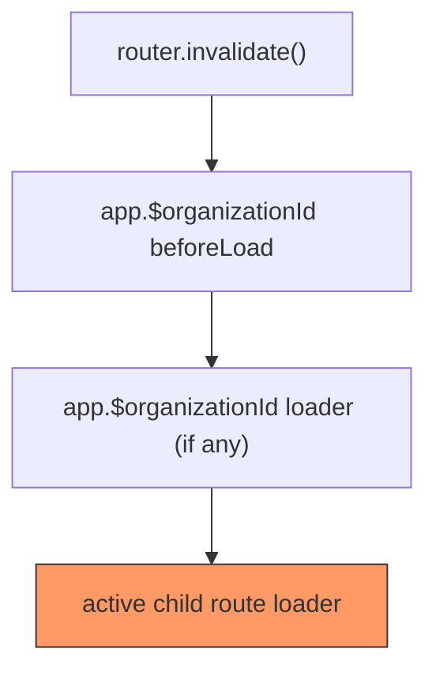

# Sidebar Activity UI Research

## Problem

Add a persistent activity feed to the sidebar so it's visible across all `/app/$organizationId/*` routes. Must coexist with the existing activity card on the invoices route without creating duplicate WebSocket connections.

## Critical Finding: Duplicate WebSocket Risk

`useAgent` wraps `usePartySocket` (line 459 of `refs/agents/.../react.tsx`) which creates a **new WebSocket per hook instance**. There is no built-in connection deduplication. Two `useAgent` calls with the same `{agent, name}` = two WebSocket connections to the same Durable Object.

```tsx
// refs/agents/packages/agents/src/react.tsx:459
const agent = usePartySocket({
  ...socketOptions,
  enabled: socketEnabled,
  onMessage: (message) => { ... },
});
```

This means naively adding `useAgent` in both the sidebar and the invoices route **will** create 2 concurrent WebSockets.

## Architecture: Lift `useAgent` to Layout + Context for Full Agent Access

Move the single `useAgent` call to `app.$organizationId.tsx` (the layout route). Expose the agent connection via React context so nested routes can access `call`, `stub`, `setState`, etc. Use React Query cache as the data bus for activity messages.

### Why context is needed alongside query cache

`useAgent` returns more than messages — it returns the full agent socket with `call`, `stub`, `setState`, `ready`. Future routes will need these capabilities (e.g., an agent chat route calling RPCs, a settings route updating agent state). Query cache handles the broadcast messages well, but the socket itself must be shared via context.

### How it works

```
app.$organizationId.tsx (layout)
│
├── useAgent (single WebSocket)
│   ├── onMessage → queryClient.setQueryData(activityQueryKey, ...)
│   └── onMessage → route-specific invalidation (dispatched, not hardcoded)
│
├── <OrganizationAgentContext.Provider value={agent}>
│   ├── <AppSidebar>
│   │   └── useQuery(activityQueryKey) → renders activity feed
│   └── <Outlet>
│       ├── invoices.tsx
│       │   └── useQuery(activityQueryKey) → activity (read-only)
│       │   └── useOrganizationAgent() → if RPC needed in future
│       ├── agent.tsx
│       │   └── useOrganizationAgent() → stub.someMethod(), setState()
│       └── future-route.tsx
│           └── useOrganizationAgent() → call(), stub
```

### Context shape

```tsx
// src/lib/OrganizationAgent.tsx
interface OrganizationAgentContext {
  readonly call: AgentMethodCall<OrganizationAgent>;
  readonly stub: AgentStub<OrganizationAgent>;
  readonly setState: (state: State) => void;
  readonly ready: Promise<void>;
}

const OrganizationAgentCtx = React.createContext<OrganizationAgentContext | null>(null);

const useOrganizationAgent = () => {
  const ctx = React.useContext(OrganizationAgentCtx);
  if (!ctx) throw new Error("useOrganizationAgent must be used within OrganizationAgentProvider");
  return ctx;
};
```

The context exposes only the RPC/state interface — **not** the raw socket or `onMessage`. Messages flow through query cache exclusively. This keeps the context stable (no re-renders on every message) while still giving nested routes full agent capabilities.

### Invalidation concern: `router.invalidate()` is broad

When the layout route calls `router.invalidate()`, TanStack Router re-runs **all active route loaders** in the current tree:



**Example of unnecessary work:**

1. User is on `/app/org123/members`
2. An invoice extraction completes → broadcast arrives
3. Layout's `onMessage` calls `router.invalidate()`
4. Members route loader re-runs (fetches member list from server) — **wasted call**, nothing changed

**Negative impacts:**
- Unnecessary server roundtrips on unrelated routes
- Brief loading states / spinners on pages that have no new data
- Scales poorly as more child routes are added

### Solution: Scoped invalidation via query keys instead of `router.invalidate()`

Replace the broad `router.invalidate()` with targeted `queryClient.invalidateQueries()` calls. Each route owns its query keys; only relevant caches get invalidated.

```tsx
// In layout's onMessage handler:
onMessage: (event) => {
  const message = decodeActivityMessage(event);
  if (!message) return;

  // Always: update activity cache
  queryClient.setQueryData(
    activityQueryKey(organizationId),
    (current: readonly ActivityMessage[] | undefined) =>
      [message, ...(current ?? [])].slice(0, 50),
  );

  // Scoped: only invalidate invoice-related queries
  if (shouldInvalidateForInvoice(message.text)) {
    queryClient.invalidateQueries({
      queryKey: ["organization", organizationId, "invoices"],
    });
    queryClient.invalidateQueries({
      queryKey: ["organization", organizationId, "invoiceItems"],
    });
  }

  // Future: other message types invalidate other query keys
  // if (shouldInvalidateForBilling(message.text)) { ... }
};
```

This eliminates `router.invalidate()` entirely. Routes that use `useQuery` with matching keys auto-refetch; routes with non-matching keys are untouched.

**But wait — the invoices route uses a loader (`Route.useLoaderData()`), not `useQuery`, for the invoice list.** To make scoped invalidation work, the invoices route needs to switch from loader-based data fetching to `useQuery`-based. This is a good change anyway: it decouples the invoice list from route navigation lifecycle and lets query invalidation drive refetches precisely.

### Coupling concern: layout shouldn't know about invoice logic

Currently `shouldInvalidateForActivity` is hardcoded with invoice-specific strings. As more features are added (billing events, member events, etc.), the layout route becomes a routing table for every domain's invalidation logic.

**Solution: Registry pattern.** Each route registers its own invalidation rules. The layout's `onMessage` dispatches to all registered handlers.

```tsx
// src/lib/Activity.ts
type ActivityHandler = (message: ActivityMessage, queryClient: QueryClient) => void;

const handlers = new Set<ActivityHandler>();

const registerActivityHandler = (handler: ActivityHandler) => {
  handlers.add(handler);
  return () => { handlers.delete(handler); };
};

const dispatchActivity = (message: ActivityMessage, queryClient: QueryClient) => {
  for (const handler of handlers) handler(message, queryClient);
};
```

```tsx
// In invoices route (registers on mount, unregisters on unmount):
React.useEffect(() => {
  return registerActivityHandler((message, qc) => {
    if (shouldInvalidateForInvoice(message.text)) {
      qc.invalidateQueries({ queryKey: ["organization", organizationId, "invoices"] });
      qc.invalidateQueries({ queryKey: ["organization", organizationId, "invoiceItems"] });
    }
  });
}, [organizationId]);
```

```tsx
// Layout's onMessage — domain-agnostic:
onMessage: (event) => {
  const message = decodeActivityMessage(event);
  if (!message) return;
  queryClient.setQueryData(activityQueryKey(organizationId), ...);
  dispatchActivity(message, queryClient);
};
```

Now the layout route knows nothing about invoices, billing, or any other domain. Each route owns its own invalidation logic and registers/unregisters as it mounts/unmounts. The layout just broadcasts.

## Sidebar UI

```
┌──────────────────────┐
│ Logo + Org Switcher   │  SidebarHeader
├──────────────────────┤
│ Home                  │
│ Agent                 │  SidebarContent > SidebarGroup
│ Invoices              │
│ ...                   │
├──────────────────────┤
│ ● Invoice uploaded    │
│ ● Extraction done     │  SidebarContent > SidebarGroup (mt-auto)
│ ● ...                 │  ScrollArea, compact, most recent at top
├──────────────────────┤
│ user@email.com ▾      │  SidebarFooter
└──────────────────────┘
```

- Second `SidebarGroup` at bottom of `SidebarContent` with `className="mt-auto"`
- Compact items: small text, dot indicators, relative timestamps
- ScrollArea for overflow, most recent at top, capped at 50 in cache
- When collapsed: dot/badge indicator for unread count

## Decisions

- Show all messages with scroll, most recent at top, cache cap ~50
- Unread indicator when sidebar collapsed: yes
- Clicking activity does not navigate
- Invoices route activity card: removed (sidebar replaces it)
- No filtering by type

## Migration Plan

1. Create `src/lib/OrganizationAgentContext.tsx` — context + `useOrganizationAgent` hook
2. Create shared helpers in `src/lib/Activity.ts` — `activityQueryKey`, `decodeActivityMessage`, `dispatchActivity`, `registerActivityHandler`
3. Update `app.$organizationId.tsx`:
   - Add `useAgent` in `RouteComponent`
   - Wrap `<Outlet>` with context provider
   - `onMessage` → write to query cache + `dispatchActivity`
4. Add activity UI to `AppSidebar` — `useQuery(activityQueryKey)` + render
5. Update `app.$organizationId.invoices.tsx`:
   - Remove `useAgent`
   - Remove activity card UI
   - Switch invoice list from loader to `useQuery` (enables scoped invalidation)
   - Register invalidation handler via `registerActivityHandler`
   - Use `useOrganizationAgent()` if RPC access needed
6. Update `app.$organizationId.agent.tsx` — replace its `useAgent` with `useOrganizationAgent()` from context

## Key Files

1. `src/lib/OrganizationAgentContext.tsx` — new: context + provider + hook
2. `src/lib/Activity.ts` — extend: shared helpers, registry
3. `src/routes/app.$organizationId.tsx` — modify: add useAgent, context provider, onMessage
4. `src/routes/app.$organizationId.invoices.tsx` — modify: remove useAgent, remove activity card, register handler
5. `src/routes/app.$organizationId.agent.tsx` — modify: use context instead of useAgent
